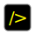
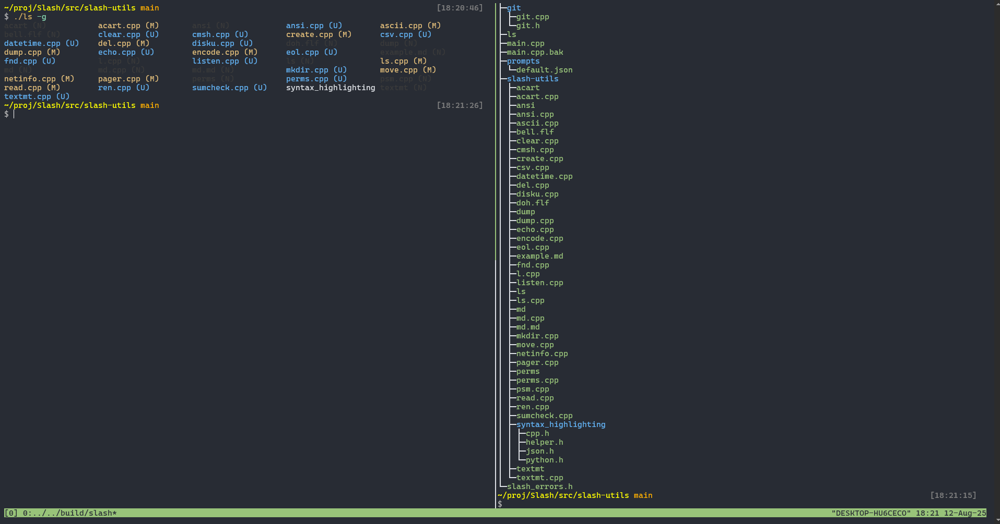
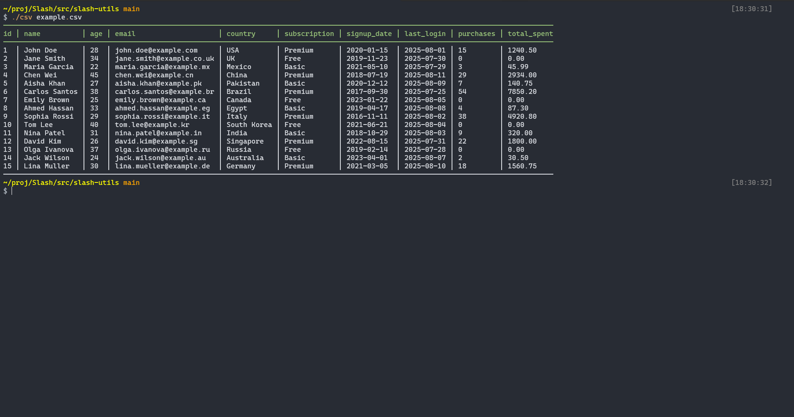
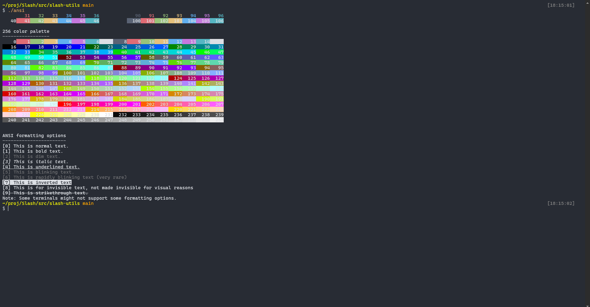
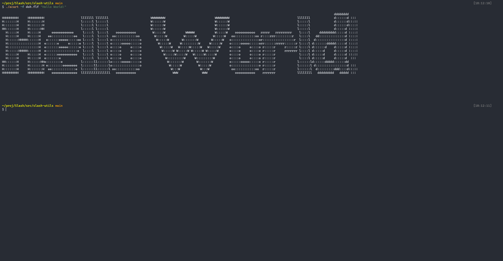
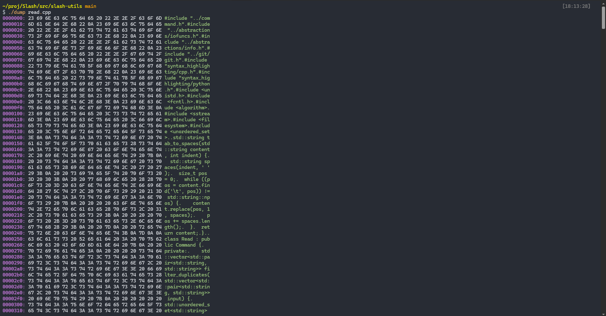
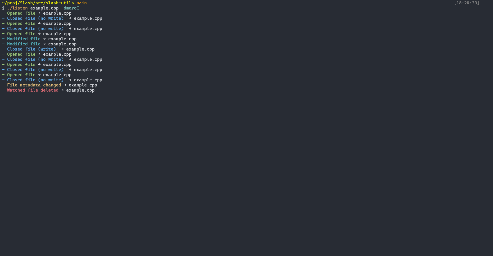

# Welcome to slash!
  
*Unconfirmed slash logo*<br><br>

slash is a project that aims to create a customizable, vibrant, and modern shell, along with a suite of utilities designed for educational, practical, and evcen creative use cases!

# Slash is in Beta!
All the basics of a shell were added, and finished on 17 June 2025. Slash is not in Alpha anymore. This means:
1. Slash is almost eligible to become a legitimate shell
2. It's no longer plagued with errors
3. You can (almost) use Slash like any other shell

## Features
- Easily customizable syntax highlighting and prompt with JSON, for a terminal that feels like home
- A rich suite of feature-rich utilties built in (`slash-utils`)
- Helpful, short, and visually pleasing help messages
- 

# Known bugs
- Flickering prompts and no multiline support yet (only for one-line prompts)
- "Illegal instruction" in WSL systems (i have no idea why. If you know the solution please help out)

## The Slash Philosophy
Every Slash utility shas to follow a unified philosophy:
1. Errors and notices should be color coded
2. The utility must be vibrant, but not garnish. It can follow a theme, or a color set. ANSI color codes should not be written raw and should be decalred in a header file for all to be used. If possible, let it comply with the current Slash theme set. (coming soon)
3. The utility must fulfill its purpose very well. It should be simple but feature rich at the same time.
4. The code should be **clean, simple to read**, and should not make the reader think hard
5. If it is a complex utility, the functions must be split into separate files. For example, an editor designed for programming must be split into editor.h, autocomplete.h, file_operations.h, vcs.h, ...
6. Do not let the library you are using limit your feature set. If that is the case, it is time to either make your own, or choose another library
7. Avoid storing data in binary files, thinking it's cool and edgy. Store settings in JSON, YAML, TOML, or any easy to understand types. 

# Installation
Installing slash is pretty straightforward if you have the dependencies:
- g++
- cmake
- libgit2
- boost::regex
- OpenSSL
- nlohmann::json

## Unix-based systems
1. Download the entire source code and change your working directory to the root of the source code
2. Compile `install_slash.cpp` with the following command:
   ```g++ install_slash.cpp -o install_slash```
3. Run the installer with:
   ```./install_slash```
   If the installer fails, most likely in moving the slash binary to /usr/local/bin, rerun the installer with elevated privileges (`sudo`)
4. Follow the instructions and slash should be installed!  

After installation, you may delete the slash source code and the installer safely.

## Windows
slash does not support Windows directly. You have to use the Windows Subsystem for Linux. Maybe someday though..

# Uninstallation
To uninstall slash, simply delete the directory `~/.slash` and also `/usr/bin/slash`

# Screenshots

## slash-utils

 <br>

 <br>
 <br>


# A missing feature?
Just open an issue. If I really like it, I'll implement it within a day or two.

# Want to support me?
You can donate to me at [my BuyMeACoffee Page](https://buymeacoffee.com/msa_1618). Even if it's just a dollar, it would really encourage me to continue and I would greatly appreciate it.
